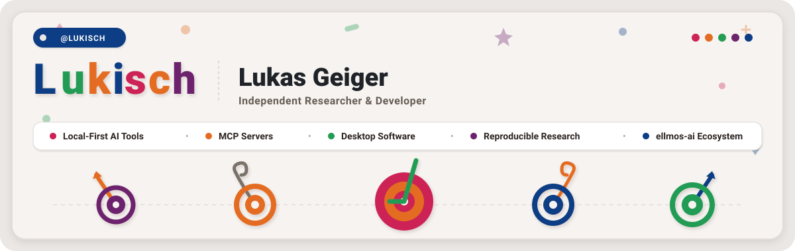

# Lukas Geiger

  

Independent researcher and developer building **local-first AI tools, MCP servers, desktop software, and reproducible research code**.

Use this profile as a map of the public GitHub ecosystem. For machine-readable context, see [`llms.txt`](https://github.com/lukisch/lukisch/blob/main/llms.txt).

> [!NOTE]
> **AI & Agent Integration Notice**: Machine-readable ecosystem details, entity mapping, and project scopes are structured in [`llms.txt`](llms.txt) for LLM indexing, RAG systems, and AI context assembly.

<!-- last-checked: 2026-08-10 -->

---

###  Featured & Pinned Repositories

Core open-source projects highlighted from across the ecosystem:

| Repository | Focus | Purpose & Description |
|---|---|---|
| [ellmos-ai/bach](https://github.com/ellmos-ai/bach) | `ellmos-ai` | Local-first text-based OS for LLM agents with SQLite memory, handlers, tools, MCP servers, scheduler and multi-agent orchestration |
| [ellmos-ai/n8n-manager-mcp](https://github.com/ellmos-ai/n8n-manager-mcp) | `ellmos-ai` | MCP server for n8n workflow management: view, create, sync and manage n8n workflows via AI assistants |
| [file-bricks/NoteSpaceLLM](https://github.com/file-bricks/NoteSpaceLLM) | `file-bricks` | Local NotebookLM alternative for private document analysis, local RAG, document chat and AI report exports |
| [dev-bricks/CareCenter-for-Codex](https://github.com/dev-bricks/CareCenter-for-Codex) | `dev-bricks` | Unofficial local Windows tray + CLI to repair, clean up and safely maintain the OpenAI Codex desktop app |
| [ellmos-ai/companion-for-agy](https://github.com/ellmos-ai/companion-for-agy) | `ellmos-ai` | Unofficial node-pty/ConPTY wrapper for agy (Antigravity CLI / Gemini CLI) that captures terminal-buffer responses as stdout for automation |

  

###  Ecosystem Map

I work across a small public GitHub ecosystem:

  
  
  
  
  
   
  
  
  
  
  
  

| Start here | What you will find |
|---|---|
| [ellmos-ai](https://github.com/ellmos-ai) | LLM operating systems, Model Context Protocol servers, agent memory, orchestration, and self-hosted AI infrastructure |
| [open-bricks](https://github.com/open-bricks) | Umbrella for local-first desktop software and practical tools |
| [file-bricks](https://github.com/file-bricks) | File, document, OCR, SQLite, prompt, and knowledge-management apps |
| [doc-bricks](https://github.com/doc-bricks) | Mail, PDF, reading, document, and archival utilities |
| [dev-bricks](https://github.com/dev-bricks) | Python IDEs, static-analysis tools, and developer utilities |
| [research-line](https://github.com/research-line) | Open-science repositories, papers, reproducible code, and research prototypes |
| [um-bruch](https://github.com/um-bruch) | Research-use civic, health-policy, and diagnostic-prototype repositories |
| [biotec-line](https://github.com/biotec-line) | Local-first bioinformatics tools for VCF and genotype workflows |
| [entertain-and-more](https://github.com/entertain-and-more) | Small games and AI-assisted entertainment experiments |
| [assistassets-ai](https://github.com/assistassets-ai) | Local-first software assistants: desktop software with assistive functions, starting with FinancialProof for finance-oriented evidence review |
| [lukisch](https://github.com/lukisch) | Direct user repositories, phone-call agent projects, curated resource lists, and legal imprint |

---

###  Find the Right Entry Point

| If you are looking for | Start with |
|---|---|
| Local AI agents, MCP servers, or self-hosted automation | [ellmos-ai](https://github.com/ellmos-ai) |
| Practical Windows desktop tools that keep data local | [open-bricks](https://github.com/open-bricks), [file-bricks](https://github.com/file-bricks), [doc-bricks](https://github.com/doc-bricks) |
| Developer tools, Python IDE helpers, or static-analysis utilities | [dev-bricks](https://github.com/dev-bricks) |
| Papers, reproducible experiments, or research prototypes | [research-line](https://github.com/research-line) |
| Curated AI & MCP resource lists or legal disclosures | [lukisch](https://github.com/lukisch) ([Awesome-LLM](https://github.com/lukisch/Awesome-LLM), [awesome-mcp-servers](https://github.com/lukisch/awesome-mcp-servers), [impressum](https://github.com/lukisch/impressum)) |
| Phone-call agent skills and safety patterns | [awesome-phone-call-agents](https://github.com/lukisch/awesome-phone-call-agents) |
| Civic research, prescribing-rule analysis, or diagnostic research prototypes | [um-bruch](https://github.com/um-bruch) |

  

###  AI Infrastructure

The `ellmos-ai` repositories are the core technical layer for local AI work: agent memory, file and code tools, n8n automation, self-hosted stacks, and LLM orchestration.

| Project | Scope |
|---|---|
| [ellmos](https://github.com/ellmos-ai/ellmos) | Local-first LLM operating-system hub for BACH, Rinnsal, gardener, MCP servers, skills, and orchestration |
| [BACH](https://github.com/ellmos-ai/bach) | Text-based LLM operating system with handlers, tools, skills, memory, and automation modules |
| [ellmos FileCommander MCP](https://github.com/ellmos-ai/ellmos-filecommander-mcp) | MCP server for local filesystem, process, search, PDF, markdown, and session operations |
| [ellmos CodeCommander MCP](https://github.com/ellmos-ai/ellmos-codecommander-mcp) | MCP server for code analysis, AST inspection, import management, and project navigation |
| [ellmos Clatcher MCP](https://github.com/ellmos-ai/ellmos-clatcher-mcp) | MCP server for JSON repair, format conversion, duplicate detection, and batch operations |
| [ellmos Homebase MCP](https://github.com/ellmos-ai/ellmos-homebase-mcp) | MCP server for local-first LLM orchestration, memory, routing, API discovery, and automation |
| [ellmos ServerCommander MCP](https://github.com/ellmos-ai/ellmos-servercommander-mcp) | MCP server for server health checks, log analysis, dry-run deploy manifests, and mail diagnostics |
| [ellmos ControlCenter MCP](https://github.com/ellmos-ai/ellmos-controlcenter-mcp) | MCP control plane for local server discovery, profile management, capability bundles, and policy audits |
| [n8n Manager MCP](https://github.com/ellmos-ai/n8n-manager-mcp) | MCP server for inspecting and managing n8n workflows |
| [n8n Workflow Manager](https://github.com/ellmos-ai/n8n-workflow-manager) | Local-first n8n workflow manager with visual graph viewer, REST API, CLI, and multi-server sync |
| [rinnsal](https://github.com/ellmos-ai/rinnsal) | Lightweight local-first agent infrastructure for SQLite memory, tasks, connectors, and chain automation |
| [gardener](https://github.com/ellmos-ai/gardener) | LLM-native SQLite operating-system experiment with searchable memory and task databases |
| [MarbleRun](https://github.com/ellmos-ai/MarbleRun) | Local-first Claude Code automation for autonomous LLM-agent chains |
| [ellmos-tests](https://github.com/ellmos-ai/ellmos-tests) | Evaluation framework for SKILL.md-based LLM operating systems and agent hubs |
| [skills](https://github.com/ellmos-ai/skills) | Portable SKILL.md library for Claude Code, Codex-compatible agents, BACH, and local-first LLM workflows |
| [USMC](https://github.com/ellmos-ai/usmc) | United Shared Memory Client: local SQLite memory for LLM agents |
| [swarm-ai](https://github.com/ellmos-ai/swarm-ai) | Python toolkit for parallel LLM-agent orchestration patterns |
| [clutch](https://github.com/ellmos-ai/clutch) | Provider-neutral LLM routing, budget tracking, and orchestration helper |
| [ellmos-stack](https://github.com/ellmos-ai/ellmos-stack) | Self-hosted AI stack around Ollama, n8n, memory, and knowledge tools |
| [task-master](https://github.com/ellmos-ai/task-master) | Standalone SQLite task management module for agent workflows |

  

###  Local-First Desktop Software

The `open-bricks` family focuses on practical tools that run locally, keep user data under user control, and expose files or JSON exports where useful.

| Area | Examples |
|---|---|
| File and data tools | [ExplorerPro](https://github.com/file-bricks/ExplorerPro), [ProFiler](https://github.com/file-bricks/ProFiler), [ProSync](https://github.com/file-bricks/ProSync), [SQLiteViewer](https://github.com/file-bricks/SQLiteViewer), [CloudLockFixer](https://github.com/file-bricks/CloudLockFixer) |
| Knowledge, prompt, and software-library tools | [NoteSpaceLLM](https://github.com/file-bricks/NoteSpaceLLM), [MetaWiki](https://github.com/file-bricks/MetaWiki), [promptboard](https://github.com/file-bricks/promptboard), [ProfiPrompt](https://github.com/file-bricks/ProfiPrompt), [knowledgedigest](https://github.com/file-bricks/knowledgedigest), [SoftwareCenter](https://github.com/file-bricks/SoftwareCenter) |
| Browser and clipboard tools | [RSS-BOOK](https://github.com/file-bricks/RSS-BOOK), [RSS-BOOKSTORE](https://github.com/file-bricks/RSS-BOOKSTORE), [AmpelClip](https://github.com/file-bricks/AmpelClip) |
| Document and mail tools | [DokuReader](https://github.com/doc-bricks/DokuReader), [UniversalDocsGrabber](https://github.com/doc-bricks/UniversalDocsGrabber), [UniversalMailCleaner](https://github.com/doc-bricks/UniversalMailCleaner), [UniversalInvoiceMail](https://github.com/doc-bricks/UniversalInvoiceMail), [MailProcessor](https://github.com/doc-bricks/MailProcessor) |
| Reading and media tools | [CleanMarkdown](https://github.com/doc-bricks/CleanMarkdown), [LitZentrum](https://github.com/doc-bricks/LitZentrum), [MediaBrain](https://github.com/doc-bricks/MediaBrain) |
| Developer tools | [DevCenter](https://github.com/dev-bricks/DevCenter), [pythonbox](https://github.com/dev-bricks/pythonbox), [MethodenAnalyser](https://github.com/dev-bricks/MethodenAnalyser), [CodeBox](https://github.com/dev-bricks/CodeBox), [apiprober](https://github.com/dev-bricks/apiprober), [WinStorePackager](https://github.com/file-bricks/WinStorePackager) |
| Cross-agent infrastructure | [ticket-master](https://github.com/ellmos-ai/ticket-master), [lock-master](https://github.com/dev-bricks/lock-master), [sync-master](https://github.com/dev-bricks/sync-master) — core components of [ellmos-ai/agent-ops-stack](https://github.com/ellmos-ai/agent-ops-stack) |
| Codex and agent helper tools | [CareCenter-for-Codex](https://github.com/dev-bricks/CareCenter-for-Codex), [safe-start-for-codex](https://github.com/dev-bricks/safe-start-for-codex), [companion-for-agy](https://github.com/ellmos-ai/companion-for-agy) |
| Bioinformatics | [VFDistiller](https://github.com/biotec-line/VFDistiller), [genotype-to-vcf](https://github.com/biotec-line/genotype-to-vcf) |
| Finance and entertainment | [FinancialProof](https://github.com/assistassets-ai/FinancialProof), [ChatAndChess](https://github.com/entertain-and-more/ChatAndChess), [rpx](https://github.com/entertain-and-more/rpx) |

---

###  Research Repositories

`research-line` contains working papers, reproducible code packages, and research software. Some repositories are exploratory or research-use-only; each project README states its own scope and status.

| Repository | Field |
|---|---|
| [functional-stability-theory](https://github.com/research-line/functional-stability-theory) | Functional stability, quantum field theory, and cosmology |
| [crm-cosmology](https://github.com/research-line/crm-cosmology) | Conformal Rescaling Model and dark-energy research |
| [rh-even-dominance](https://github.com/research-line/rh-even-dominance) | Riemann Hypothesis related even-dominance material |
| [ai-elite-swr](https://github.com/research-line/ai-elite-swr) | Worldview reconstruction of AI leadership texts |
| [fst-nash](https://github.com/research-line/fst-nash) | Potential-game diagnostics for chaperone systems and protein-folding regimes |

---

###  Applied Research and Civic Prototypes

`um-bruch` contains research-use-only civic, health-policy, and diagnostic-prototype repositories. These projects are not medical devices and do not provide clinical, legal, or financial advice.

| Repository | Field |
|---|---|
| [verordnungsampel](https://github.com/um-bruch/verordnungsampel) | Local-first research software for German prescribing-rule analysis |
| [regressangst](https://github.com/um-bruch/regressangst) | Working-paper repository around prescribing-audit recourse anxiety and health-policy transparency |
| [multiaxial-diagnostic-system](https://github.com/um-bruch/multiaxial-diagnostic-system) | Research-use-only multiaxial diagnostic documentation prototype |
| [system-medicine](https://github.com/um-bruch/system-medicine) | Research-only functional pathway medical knowledge graph |
| [locuterra](https://github.com/um-bruch/locuterra) | Gemeinwohlorientiertes, ortsbasiertes Social-Network-Konzept und Demonstrator |

---

###  Direct Repositories & Curated Lists

Repositories hosted directly under the personal [@lukisch](https://github.com/lukisch) account:

| Repository | Purpose & Description |
|---|---|
| [Awesome-LLM](https://github.com/lukisch/Awesome-LLM) | Curated list of Awesome LLM resources, frameworks, research papers, and courses |
| [awesome-mcp-servers](https://github.com/lukisch/awesome-mcp-servers) | Curated collection of Model Context Protocol (MCP) servers, clients, and tools |
| [impressum](https://github.com/lukisch/impressum) | Public legal notice, imprint, and provider identification for web services |
| [awesome-phone-call-agents](https://github.com/lukisch/awesome-phone-call-agents) | Community hub for reusable phone-call Agent Skills, apps, adapters, scheduler recipes, and safety patterns |

  

###  Technology Keywords

Python, PySide6, TypeScript, Node.js, SQLite, Model Context Protocol, MCP servers, local-first software, privacy-first desktop apps, LLM agents, Ollama, Claude Code, n8n, OCR, PDF tools, reproducible research.

---

###  Links & Verification

---

## Haftung / Liability

Dieses Projekt ist eine **unentgeltliche Open-Source-Schenkung** im Sinne der §§ 516 ff. BGB. Die Haftung des Urhebers ist gemäß **§ 521 BGB** auf **Vorsatz und grobe Fahrlässigkeit** beschränkt. Ergänzend gelten die Haftungsausschlüsse aus GPL-3.0 / MIT / Apache-2.0 §§ 15-16, je nach gewählter Lizenz.

Nutzung auf eigenes Risiko. Keine Wartungszusage, keine Verfügbarkeitsgarantie, keine Gewähr für Fehlerfreiheit oder Eignung für einen bestimmten Zweck.

This project is an unpaid open-source donation. Liability is limited to intent and gross negligence under Section 521 of the German Civil Code. Use at your own risk. No warranty, maintenance guarantee, availability guarantee, or fitness for a particular purpose is assumed.
