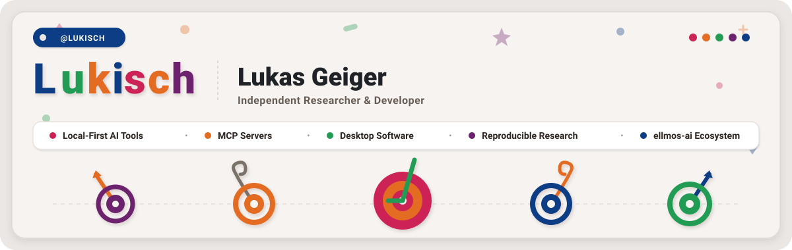

# Lukas Geiger

  

Unabhängiger Forscher und Entwickler mit Schwerpunkt auf **lokal-zentrierten KI-Werkzeugen (local-first), MCP-Servern, Desktop-Software und reproduzierbarem Forschungscode**.

Dieses Profil dient als Übersicht und Wegweiser durch das öffentliche GitHub-Ökosystem. Maschinenlesbarer Kontext ist in [`llms.txt`](https://github.com/lukisch/lukisch/blob/main/llms.txt) hinterlegt. | 🇺🇸 **[English version](README.md)**

> [!NOTE]
> **Hinweis zur KI- und Agenten-Integration**: Strukturierte Details zum Ökosystem, Entitäten-Mappings und Projektbereiche sind in [`llms.txt`](llms.txt) für LLM-Indexierung, RAG-Systeme und KI-Kontextaufbau bereitgestellt.

<!-- last-checked: 2026-09-28 -->

---

###  Hervorgehobene & Ausgewählte Repositories

Zentrale Open-Source-Projekte aus dem gesamten Ökosystem im Fokus:

| Repository | Fokus | Zweck & Beschreibung |
|---|---|---|
| [ellmos-ai/bach](https://github.com/ellmos-ai/bach) | `ellmos-ai` | Lokal-zentriertes textbasiertes Betriebssystem für KI-Agenten mit SQLite-Gedächtnis, Handlern, Werkzeugen, MCP-Servern, Scheduler und Multi-Agenten-Orchestrierung |
| [ellmos-ai/n8n-manager-mcp](https://github.com/ellmos-ai/n8n-manager-mcp) | `ellmos-ai` | MCP-Server zur Verwaltung von n8n-Workflows: Workflows per KI-Assistent anzeigen, erstellen, synchronisieren und verwalten |
| [file-bricks/NoteSpaceLLM](https://github.com/file-bricks/NoteSpaceLLM) | `file-bricks` | Lokale NotebookLM-Alternative zur privaten Dokumentenanalyse, lokalem RAG, Dokumenten-Chat und KI-Berichtsexporten |
| [dev-bricks/CareCenter-for-Codex](https://github.com/dev-bricks/CareCenter-for-Codex) | `dev-bricks` | Inoffizielles lokales Windows-Tray- und CLI-Tool zur Reparatur, Bereinigung und sicheren Wartung der OpenAI Codex Desktop-App |
| [ellmos-ai/companion-for-agy](https://github.com/ellmos-ai/companion-for-agy) | `ellmos-ai` | Inoffizieller node-pty/ConPTY-Wrapper für agy (Antigravity CLI / Gemini CLI), der Terminal-Pufferantworten als Standardausgabe für die Automation erfasst |

  

###  Ökosystem-Übersicht

Ich entwickle über ein strukturiertes öffentliches GitHub-Ökosystem hinweg:

  
  
  
  
  
   
  
  
  
  
  
  

| Einstieg | Was Sie dort finden |
|---|---|
| [ellmos-ai](https://github.com/ellmos-ai) | LLM-Betriebssysteme, Model Context Protocol Server, Agenten-Gedächtnis, Orchestrierung und selbstgehostete KI-Infrastruktur |
| [open-bricks](https://github.com/open-bricks) | Dachorganisation für lokale Desktop-Software und praktische Werkzeuge |
| [file-bricks](https://github.com/file-bricks) | Datei-, Dokument-, OCR-, SQLite-, Prompt- und Wissensmanagement-Anwendungen |
| [doc-bricks](https://github.com/doc-bricks) | E-Mail-, PDF-, Lese-, Dokument- und Archiv-Dienstprogramme |
| [dev-bricks](https://github.com/dev-bricks) | Python-IDEs, Werkzeuge zur statischen Code-Analyse und Entwickler-Tools |
| [research-line](https://github.com/research-line) | Open-Science-Repositories, Paper, reproduzierbarer Code und Forschungsprototypen |
| [um-bruch](https://github.com/um-bruch) | Gemeinwohlorientierte, gesundheitspolitische und diagnostische Forschungsprototypen |
| [biotec-line](https://github.com/biotec-line) | Lokale Bioinformatik-Werkzeuge für VCF- und Genotyp-Workflows |
| [entertain-and-more](https://github.com/entertain-and-more) | Kleine Spiele und KI-gestützte Unterhaltungsexperimente |
| [assistassets-ai](https://github.com/assistassets-ai) | Lokale Software-Assistenten: Desktop-Software mit Assistenzfunktionen, beginnend mit FinancialProof zur finanzorientierten Evidenzprüfung |
| [lukisch](https://github.com/lukisch) | Direkte persönliche Repositories, Telefon-Agenten-Projekte, kuratierte Ressourcenlisten und Impressum |

---

###  Den passenden Einstiegspunkt finden

| Wenn Sie suchen nach | Beginnen Sie bei |
|---|---|
| Lokalen KI-Agenten, MCP-Servern oder selbstgehosteter Automation | [ellmos-ai](https://github.com/ellmos-ai) |
| Praktischen Windows-Desktop-Tools mit vollständiger lokaler Datenkontrolle | [open-bricks](https://github.com/open-bricks), [file-bricks](https://github.com/file-bricks), [doc-bricks](https://github.com/doc-bricks) |
| Entwickler-Tools, Python-IDE-Helfern oder statischer Code-Analyse | [dev-bricks](https://github.com/dev-bricks) |
| Papern, reproduzierbaren Experimenten oder Forschungsprototypen | [research-line](https://github.com/research-line) |
| Kuratierten KI- & MCP-Listen oder rechtlichen Angaben | [lukisch](https://github.com/lukisch) ([Awesome-LLM](https://github.com/lukisch/Awesome-LLM), [awesome-mcp-servers](https://github.com/lukisch/awesome-mcp-servers), [impressum](https://github.com/lukisch/impressum)) |
| Telefon-Agenten-Skills und Sicherheitsmustern | [awesome-phone-call-agents](https://github.com/lukisch/awesome-phone-call-agents) |
| Gemeinwohlforschung, Verordnungsanalysen oder diagnostischen Forschungsprototypen | [um-bruch](https://github.com/um-bruch) |

  

###  KI-Infrastruktur

Die `ellmos-ai`-Repositories bilden das technische Fundament für lokale KI-Arbeit: Agenten-Gedächtnis, Datei- und Code-Werkzeuge, n8n-Automatisierung, selbstgehostete Stacks und LLM-Orchestrierung.

| Projekt | Bereich & Fokus |
|---|---|
| [ellmos](https://github.com/ellmos-ai/ellmos) | Lokal-zentrierter LLM-Betriebssystem-Hub für BACH, Rinnsal, gardener, MCP-Server, Skills und Orchestrierung |
| [BACH](https://github.com/ellmos-ai/bach) | Textbasiertes LLM-Betriebssystem mit Handlern, Werkzeugen, Skills, Gedächtnis und Automationsmodulen |
| [ellmos FileCommander MCP](https://github.com/ellmos-ai/ellmos-filecommander-mcp) | MCP-Server für lokale Dateisystem-, Prozess-, Such-, PDF-, Markdown- und Sitzungsoperationen |
| [ellmos CodeCommander MCP](https://github.com/ellmos-ai/ellmos-codecommander-mcp) | MCP-Server für Code-Analyse, AST-Inspektion, Import-Management und Projekt-Navigation |
| [ellmos Clatcher MCP](https://github.com/ellmos-ai/ellmos-clatcher-mcp) | MCP-Server für JSON-Reparatur, Formatkonvertierung, Duplikaterkennung und Stapeloperationen |
| [ellmos Homebase MCP](https://github.com/ellmos-ai/ellmos-homebase-mcp) | MCP-Server für lokale LLM-Orchestrierung, Gedächtnis, Routing, API-Discovery und Automation |
| [ellmos ServerCommander MCP](https://github.com/ellmos-ai/ellmos-servercommander-mcp) | MCP-Server für Server-Health-Checks, Log-Analysen, Dry-Run-Deploy-Manifeste und Mail-Diagnosen |
| [ellmos ControlCenter MCP](https://github.com/ellmos-ai/ellmos-controlcenter-mcp) | MCP-Control-Plane für lokale Server-Erkennung, Profil-Management, Fähigkeits-Bundles und Policy-Audits |
| [n8n Manager MCP](https://github.com/ellmos-ai/n8n-manager-mcp) | MCP-Server zur Inspektion und Verwaltung von n8n-Workflows |
| [n8n Workflow Manager](https://github.com/ellmos-ai/n8n-workflow-manager) | Lokaler n8n-Workflow-Manager mit visuellem Graphen-Viewer, REST-API, CLI und Multi-Server-Synchronisation |
| [rinnsal](https://github.com/ellmos-ai/rinnsal) | Leichtgewichtige lokale Agenten-Infrastruktur für SQLite-Gedächtnis, Tasks, Konnektoren und Ketten-Automation |
| [gardener](https://github.com/ellmos-ai/gardener) | LLM-natives SQLite-Betriebssystem-Experiment mit durchsuchbaren Gedächtnis- und Task-Datenbanken |
| [MarbleRun](https://github.com/ellmos-ai/MarbleRun) | Lokale Claude-Code-Automatisierung für autonome LLM-Agentenketten |
| [ellmos-tests](https://github.com/ellmos-ai/ellmos-tests) | Evaluierungs-Framework für SKILL.md-basierte LLM-Betriebssysteme und Agenten-Hubs |
| [skills](https://github.com/ellmos-ai/skills) | Portable SKILL.md-Bibliothek für Claude Code, Codex-kompatible Agenten, BACH und lokale LLM-Workflows |
| [USMC](https://github.com/ellmos-ai/usmc) | United Shared Memory Client: lokales SQLite-Gedächtnis für LLM-Agenten |
| [swarm_ai](https://github.com/ellmos-ai/swarm_ai) | Lokal-zentriertes Python-Toolkit für parallele Claude- und LLM-Agenten-Orchestrierung: Consensus-Voting, Stigmergie, Boss-Worker-Schwärme und Benchmarks |
| [open-compute](https://github.com/ellmos-ai/open-compute) | Modellagnostischer Computer-Use-Kern: ein Agent-Loop für Claude, OpenAI CUA und Mock-Backend mit zentralem Sicherheitsgate ([MCP Launcher](https://github.com/ellmos-ai/open-compute-mcp)) |
| [ellmos Blender-Use MCP](https://github.com/ellmos-ai/ellmos-blender-use-mcp) | MCP-Server für headless Blender-Asset-QA: Hintergrund-Skriptausführung und FBX-Reimport-Verifikation |
| [build-your-users-mind](https://github.com/ellmos-ai/build-your-users-mind) | Anleitung für Agenten zum Aufbau eines selbstverbessernden Theory-of-Mind-Nutzermodells aus Interaktionsprotokollen |
| [system-auditor](https://github.com/ellmos-ai/system-auditor) | Evidenzbasierte System-Audits über mehrere Rechner mit Meta-Audit-Bündelung und Aggregationsleiter |
| [system-explorer](https://github.com/ellmos-ai/system-explorer) | Evidenzgestützte Systemkarten für Funktionen, Träger, Einstiegspunkte und Architekturdrift |
| [project-docs-template](https://github.com/ellmos-ai/project-docs-template) | Agenten-bereite Projektdokumentations-Vorlage mit START/STATE/TODO/DONE und LLM-freundlichem Projektgedächtnis |
| [clutch](https://github.com/ellmos-ai/clutch) | Provider-neutrales LLM-Routing, Budget-Tracking und Orchestrierungs-Helfer |
| [ellmos-stack](https://github.com/ellmos-ai/ellmos-stack) | Selbstgehosteter KI-Stack rund um Ollama, n8n, Gedächtnis und Wissenswerkzeuge |
| [task-master](https://github.com/ellmos-ai/task-master) | Eigenständiges SQLite-Task-Management-Modul für Agenten-Workflows |

  

###  Lokale Desktop-Software (Local-First)

Die `open-bricks`-Familie konzentriert sich auf praxisnahe Werkzeuge, die lokal laufen, Benutzerdaten unter voller Nutzerkontrolle behalten und Dateien oder JSON-Exporte dort bereitstellen, wo es sinnvoll ist.

| Bereich | Beispiele |
|---|---|
| Datei- und Datenwerkzeuge | [ExplorerPro](https://github.com/file-bricks/ExplorerPro), [ProFiler](https://github.com/file-bricks/ProFiler), [ProSync](https://github.com/file-bricks/ProSync), [SQLiteViewer](https://github.com/file-bricks/SQLiteViewer), [CloudLockFixer](https://github.com/file-bricks/CloudLockFixer) |
| Wissens-, Prompt- und Software-Bibliotheken | [NoteSpaceLLM](https://github.com/file-bricks/NoteSpaceLLM), [promptboard](https://github.com/file-bricks/promptboard), [ProfiPrompt](https://github.com/file-bricks/ProfiPrompt), [knowledgedigest](https://github.com/file-bricks/knowledgedigest), [SoftwareCenter](https://github.com/file-bricks/SoftwareCenter), [LaunchBoards](https://github.com/file-bricks/LaunchBoards) |
| Browser- und Zwischenablage-Tools | [RSS-BOOK](https://github.com/file-bricks/RSS-BOOK), [RSS-BOOKSTORE](https://github.com/file-bricks/RSS-BOOKSTORE), [AmpelClip](https://github.com/file-bricks/AmpelClip) |
| Dokumenten- und E-Mail-Tools | [DokuReader](https://github.com/doc-bricks/DokuReader), [DokuZen](https://github.com/doc-bricks/DokuZen), [PDFtoPDFocr](https://github.com/doc-bricks/PDFtoPDFocr), [UniversalDocsGrabber](https://github.com/doc-bricks/UniversalDocsGrabber), [UniversalMailCleaner](https://github.com/doc-bricks/UniversalMailCleaner), [UniversalInvoiceMail](https://github.com/doc-bricks/UniversalInvoiceMail), [MailProcessor](https://github.com/doc-bricks/MailProcessor) |
| Lese- und Medienwerkzeuge | [CleanMarkdown](https://github.com/doc-bricks/CleanMarkdown), [LitZentrum](https://github.com/doc-bricks/LitZentrum), [MediaBrain](https://github.com/doc-bricks/MediaBrain), [llm-note](https://github.com/doc-bricks/llm-note) |
| KI-Medien- und Kreativ-Tools | [ai-media-editor](https://github.com/ellmos-ai/ai-media-editor), [clip-storyboard-director](https://github.com/ellmos-ai/clip-storyboard-director) |
| Entwickler-Tools | [DevCenter](https://github.com/dev-bricks/DevCenter), [pythonbox](https://github.com/dev-bricks/pythonbox), [MethodenAnalyser](https://github.com/dev-bricks/MethodenAnalyser), [CodeBox](https://github.com/dev-bricks/CodeBox), [apiprober](https://github.com/dev-bricks/apiprober), [app-rotator](https://github.com/dev-bricks/app-rotator), [WikiStub-Seed](https://github.com/dev-bricks/WikiStub-Seed), [WinStorePackager](https://github.com/file-bricks/WinStorePackager) |
| Agentenübergreifende Infrastruktur | [ticket-master](https://github.com/ellmos-ai/ticket-master), [lock-master](https://github.com/ellmos-ai/lock-master), [system-gap-master](https://github.com/ellmos-ai/system-gap-master) — Kernkomponenten von [ellmos-ai/agent-ops-stack](https://github.com/ellmos-ai/agent-ops-stack) |
| Codex- und Agenten-Helfer | [CareCenter-for-Codex](https://github.com/dev-bricks/CareCenter-for-Codex), [safe-start-for-codex](https://github.com/dev-bricks/safe-start-for-codex), [companion-for-agy](https://github.com/ellmos-ai/companion-for-agy), [automizer-for-claude-desktop](https://github.com/dev-bricks/automizer-for-claude-desktop) |
| Bioinformatik | [VFDistiller](https://github.com/biotec-line/VFDistiller), [genotype-to-vcf](https://github.com/biotec-line/genotype-to-vcf) |
| Finanzen und Unterhaltung | [FinancialProof](https://github.com/assistassets-ai/FinancialProof), [ChatAndChess](https://github.com/entertain-and-more/ChatAndChess), [rpx](https://github.com/entertain-and-more/rpx) |

---

###  Forschungs-Repositories

`research-line` enthält Working Paper, reproduzierbare Code-Pakete und wissenschaftliche Software. Einige Repositories sind explorativ oder ausschließlich für Forschungszwecke bestimmt; jede Projekt-README beschreibt ihren jeweiligen Status und Geltungsbereich.

| Repository | Fachgebiet |
|---|---|
| [functional-stability-theory](https://github.com/research-line/functional-stability-theory) | Funktionale Stabilität, Quantenfeldtheorie und Kosmologie |
| [crm-cosmology](https://github.com/research-line/crm-cosmology) | Conformal Rescaling Model (CRM) und Dunkle-Energie-Forschung |
| [rh-even-dominance](https://github.com/research-line/rh-even-dominance) | Even-Dominance-Analysen im Kontext der Riemannschen Vermutung |
| [ai-elite-swr](https://github.com/research-line/ai-elite-swr) | Weltbild-Rekonstruktion maßgeblicher KI-Führungstexte |
| [fst-nash](https://github.com/research-line/fst-nash) | Potentialspiel-Diagnostik für Chaperon-Systeme und Protein-Faltungsregime |
| [abc-hct](https://github.com/research-line/abc-hct) | HCT abc-Forschungspapiere, Beweisnotizen und reproduzierbare Hecke-Quotienten-Artefakte ohne Magma |

---

###  Angewandte Forschung und Gemeinwohl-Prototypen

`um-bruch` umfasst gemeinwohlorientierte, gesundheitspolitische und diagnostische Forschungsprototypen (ausschließlich für Forschungszwecke). Diese Projekte sind keine Medizinprodukte und bieten keine klinische, rechtliche oder finanzielle Beratung.

| Repository | Fachgebiet |
|---|---|
| [verordnungsampel](https://github.com/um-bruch/verordnungsampel) | Lokale Forschungssoftware zur Analyse deutscher Verordnungsregeln (Heilmittel) |
| [regressangst](https://github.com/um-bruch/regressangst) | Working-Paper-Repository zu Regressangst bei Wirtschaftlichkeitsprüfungen und gesundheitspolitischer Transparenz |
| [multiaxial-diagnostic-system](https://github.com/um-bruch/multiaxial-diagnostic-system) | Prototyp zur multiaxialen diagnostischen Dokumentation (nur für Forschungszwecke) |
| [system-medicine](https://github.com/um-bruch/system-medicine) | Wissensgraph funktioneller Signalwege der Systemmedizin (nur für Forschungszwecke) |
| [locuterra](https://github.com/um-bruch/locuterra) | Gemeinwohlorientiertes, ortsbasiertes Social-Network-Konzept und Demonstrator |

---

###  Direkte Repositories & Kuratierte Listen

Repositories, die direkt unter dem persönlichen Profil [@lukisch](https://github.com/lukisch) geführt werden:

| Repository | Zweck & Beschreibung |
|---|---|
| [Awesome-LLM](https://github.com/lukisch/Awesome-LLM) | Kuratierte Liste mit Awesome-LLM-Ressourcen, Frameworks, Forschungsarbeiten und Kursen |
| [awesome-mcp-servers](https://github.com/lukisch/awesome-mcp-servers) | Kuratierte Sammlung von Model Context Protocol (MCP) Servern, Clients und Werkzeugen |
| [impressum](https://github.com/lukisch/impressum) | Öffentliches Impressum, rechtliche Hinweise und Anbieterkennzeichnung für Webdienste |
| [awesome-phone-call-agents](https://github.com/lukisch/awesome-phone-call-agents) | Community-Hub für wiederverwendbare Telefon-Agenten-Skills, Apps, Adapter, Scheduler-Rezepte und Sicherheitsmuster |

  

###  Technologie-Schlagworte

Python, PySide6, TypeScript, Node.js, SQLite, Model Context Protocol, MCP-Server, Local-first Software, datenschutzkonforme Desktop-Apps, LLM-Agenten, Ollama, Claude Code, n8n, OCR, PDF-Tools, reproduzierbare Forschung.

---

###  Links & Verifikation

---

## Haftung / Liability

Dieses Projekt ist eine **unentgeltliche Open-Source-Schenkung** im Sinne der §§ 516 ff. BGB. Die Haftung des Urhebers ist gemäß **§ 521 BGB** auf **Vorsatz und grobe Fahrlässigkeit** beschränkt. Ergänzend gelten die Haftungsausschlüsse aus GPL-3.0 / MIT / Apache-2.0 §§ 15-16, je nach gewählter Lizenz.

Nutzung auf eigenes Risiko. Keine Wartungszusage, keine Verfügbarkeitsgarantie, keine Gewähr für Fehlerfreiheit oder Eignung für einen bestimmten Zweck.

This project is an unpaid open-source donation. Liability is limited to intent and gross negligence under Section 521 of the German Civil Code. Use at your own risk. No warranty, maintenance guarantee, availability guarantee, or fitness for a particular purpose is assumed.
